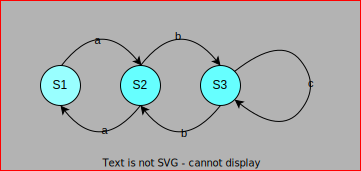

# Expresiones Regulares

Son un conjunto de caracteres tambien llamados secuencias de caracteres que forman un patron de busqueda.

principalmente utilizada para la busqueda de patrones de cadenas de caracteres u operaciones de sustituciones.

tenemos el siguiente [link](https://regexr.com/) para tener una aplicacion que nos muestre el funcionamiento del patron que estamos creando. 

## Automata finito

El automata finito es un modelo computacional que tiene una entrada de datos y su correspondiente salida, pasando por varios estados dependiendo el patron al que deseamos encontrar ejemplo si se crea la expesion **"abc"** el automata finito sera valido si pasa por todos los estados de **a** pasa a **b** y de **b** pasa a **c** y como no tiene otras condiciones solo funcionara con esas tres y ignoraria cualquier otro caracter que este despues del ultimo estado que es **c**.

