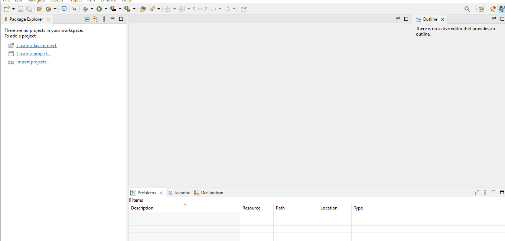

# Introduccion en Java

Para poder programar en **JAVA** debemos tener claro que JAVA usa una especie de maquina virtual donde ejecutara el codigo, con esto permite que sea **Multiplataforma** ya que no es el sistema operativo que ejecuta el codigo sino la maquina virtual de JAVA, a esta maquina o entorno se le denomina JRE siglas de Java Runtime Environment (Entorno de Ejecucion de Java).

Ademas debemos entender que este lenguaje es **Compilado** lo que indica que debe traducir el codigo que nosotros creamos (codigo fuente) a otro archivo que contienen el lenguaje que puede entender la maquina (codigo binario), en JAVA sucede esto en tres archivos.

+ Codigo fuente: son los archivos con extencion **.java**
+ bytecodes: son archivos intermedios entre el codigo fuente y el archivo binario y son los que tienen extencion **.class**
+ codigo binario: codigo traducido desde el **.class** a la maquina que se esta usando.

## Crear un proyecto basico en eclipse

Las configuraciones que debemos hacer en java para iniciar en la programacion con java son los siguientes:

+ **Prespectiva JAVA**: Window->Perspective->Open perspective->Other->JAVA.
+ **consola**: window->show view->console
+ **Nuevo projecto**: File->New->Java Project

## Caracteristicas

+ Case sensitive
+ Orientado a objetos

:::note NOTA:
El nombre del archivo debe ser el mismo que el nombre de la clase que contiene
:::

## Documentacion

+ [Api Java 19](https://docs.oracle.com/en/java/javase/19/docs/api/index.html)