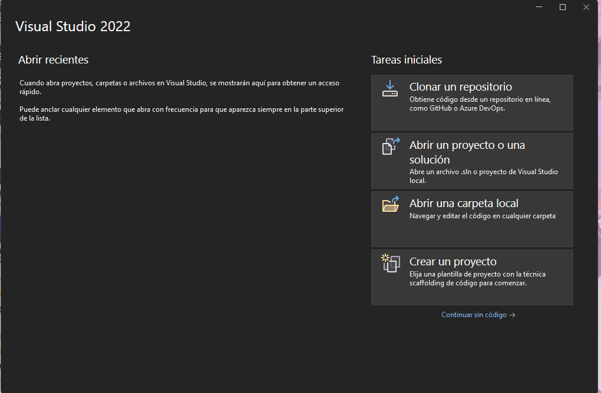

# Introduccion en Net

.net es un framework de microsoft que contiene varias herramientas de desarrollo, en la actualidad tenemos dos versiones **.net framework** que es codigo propietario y **.net core** que es codigo open source, ambos tienen en comun que se puede programar usando uno de los siguientes lenguajes:

+ c#
+ vb
+ f#


microsoft nos ofrece un ide de desarrollo que es **visual studio** que nos facilitara la tarea de crear y desarrollar un proyecto. ejemplo:



Tambien podemos instalar **dotnet** que nos permitira programar en los lenguajes mencionados anteriormente pero usando cualquier editor de texto.

ejemplo:


para poder compilar el proyecto cuando usamos **dotnet** debemos escribir en consola:

```bash 
dotnet run
```

## Caracteristicas C#

+ Case sensitive
+ Orientado a objetos
+ Tipado fuerte

## Caracteristica VB.net

+ No es case sensitive
+ Orientado a objetos
+ Tipado fuerte
