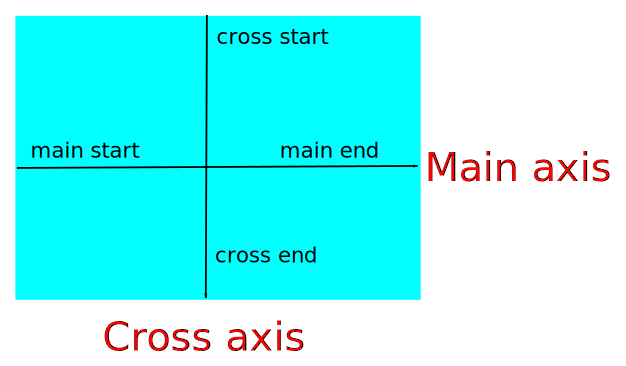

# Fundamentos flexbox

+ Es un modelo de layout que permite que las cajas sean flexibles, es un valor de la propiedad display.
+ Existe `display:flex` y `display:inline-flex` para que el contenedor sea bloque o linea respectivamente.
+ Se necesita un contenedor (flex-container) y al menos un hijo (flex-item).
+ Las cajas flexibles son los items, el contenedor es el contexto al que pertenecen los items "SOLO LOS HIJOS".

Cuando se usa el valor flex pasan las siguientes cosas internamente.

+ Existen dos ejes para colocar y alinear elementos.
+ Por defecto el eje principal es horizontal y de izquierda a derecha y el eje secundario es vertical de arriba abajo.
+ se puede intercambiar la direccion de los ejes y la direccion de ambos.
+ los ejes tienen un nombre y son el eje principal (main axis) y el eje secundario (cross axis)
+ tambien se genera un inicio y un fin en la linea principal son (main start) y (main end) y en la secundaria son (cross start y cross end)

+ flex: Convierte el contenedor en un contexto para flexbox y hace que el contenedor sea un elemento de bloque para los elementos que lo rodean.
+ inline-flex: convierte el contenedor en un contexto para flexbox y hace que el contenedor sea un elemento en linea para los elementos que lo rodean.