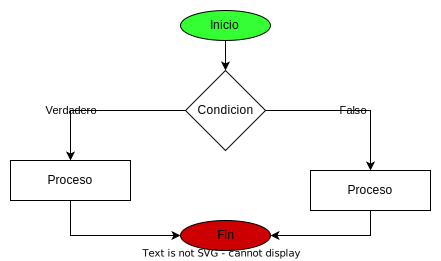

# Sentencia de control If / Else

las sentencias de control hacen referencia a que nos permite controlar el flujo del codigo que se va a ejecutar permitiendo establecer por medio de reglas que codigo se ejecuta y cual no.



## Basico

las sentencias If son condicionales, que tiene una afirmacion y dependiendo la afirmacion se establece lo que se hara si se cumple la afirmacion o lo que se hara si No se cumple la condicion.

```javascript
let afirmacion=true
if(afirmacion){
    console.log("Se ejecuta la parte verdadera")
}else{
    console.log("Se ejecuta la parte falsa")
}
```

Algo que debemos tener presente es que algunos valores a ser evaluados se interpretan como verdadero o falso.

1.  valores falsos: undefined, null, 0 , '' , ""
2.  valores verdaderos: cualquier valor que no este en la lista de falsos

## multiples condicionales

en ciertos casos se necesita comprobar mas condiciones como por ejemplo establecer que puede hacer un niño, un adulto joven o ya un adulto de edad. en estos casos se usaria multiples condicionales para establecer el bloque de codigo a ejecutar.

Ejemplo:

```javascript
let edad=18
if(edad<18){
    console.log("eres un niño")
}else if(edad>=18 && edad<60){
    console.log("eres un adulto")
}else{
    console.log("eres un adulto mayor")
}
```

## condicionales anidadas

las condiciones anidadas se trata de colocar una condicion dentro de otra ya que se necesita que sea valida la condicion anterior antes de comprobar la siguiente condicional.

Ejemplo:

```javascript
let edad=18

//Inicio condicional global
if(edad<18){

    // ***** Inicio Condicion Niño
    if(edad<0){
        console.log("No puedes tener una edad negativa")
    }else if(edad>=0 && edad<3){
        console.log("No se como usas el programa pero eres un bebe")
    }else{
        console.log("eres un niño")
    }
    // ***** Fin Condicion Niño

}else if(edad>=18 && edad<60){
    console.log("eres un adulto")
}else{

    //**** Inicio Condicion adulto
    if(edad>120){
        console.log("no se como sigues vivo pero te felicito")
    }else{
        console.log("eres un adulto mayor")
    }
    //**** Fin Condicion adulto
}
//Fin de la condicion Global
```