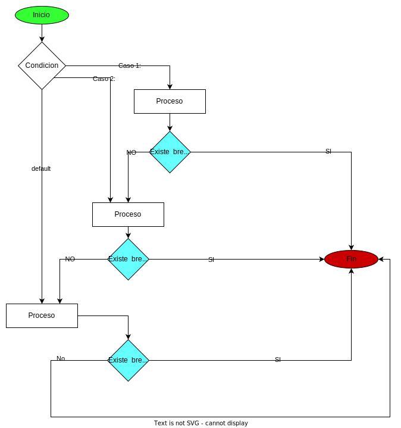

# Sentencia Switch

igual que la sentencia if nos permite ramificar el codigo y ejecutar una o otra rama dependiendo una condicion. la gran diferencia existe es que en las sentencias if podemos crear grupos o rangos de valores, incluso pueden ser infinita la condicion por ejemplo hacer algo si una persona tiene entre 18 y 50 años o si es mayor a 100 años. 

pero en las setencias switch se establecen casos por lo tanto se deben limitar los casos ***No pueden ser infinitos** y dependiendo el caso se ejecuta un codigo o otro. 

tambien existe la propiedad que se ejecuta todo el codigo despues de que se encuentra el caso por eso somos obligados a usar la palabra clave **break** para cada caso ya que esta palabra obliga a salir del bloque de codigo en ejecucion, si no se coloca se ejecutara el siguiente caso, dependiendo lo que queramos lo colocaremos o no.



Ejemplo (switch simple):

para convertir a forma escrita un numero comprendido de 1 a 5

```javascript
let numero=3
let numeroTexto

switch(numero){
    case 1:
        numeroTexto="uno"
        break
    case 2:
        numeroTexto="dos"
        break
    case 3:
        numeroTexto="tres"
        break
    case 4:
        numeroTexto="cuatro"
        break
    case 5:
        numeroTexto="cinco"
        break
    default:
        numeroTexto="Valor desconocido"
        break
}
```

Ejemplo 2 (switch multiple):

cuando no necesitamos codigo en todos los casos ejemplo el tipo de estacion segun meses del año.

```javascript
let mes="diciembre"
let estacion

switch(numero){
    case "enero":
    case "febrero":
    case "diciembre":
        estacion="Invierno"
        break

    case "marzo": case "abril": case "mayo":
        estacion="Primavera"
        break

    case "junio":
    case "julio": 
    case "agosto":   
        estacion="Verano"
        break

    case "septiembre":
    case "octubre": 
    case "noviembre":   
        estacion="Otoño"
        break

    default:
        estacion="Valor desconocido"
        break
}
```

Ejemplo: (Sintaxis multiple encadenada)

## Notas

1. Cuando se usa switch se debe tener presente que este hace una comparacion estricta lo que indica que hace comparacion de tipos es diferente 11 numeric de 11 de string.