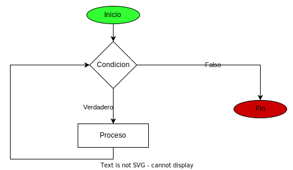

# bucle while

Este ciclo se ejecuta indefinidamente mientras la condicion de inicio sea verdadera. 



es de buena practica usar el ciclo while cuando no se conoce la cantidad de iteraciones, por eso cuando se usa contadores en el while indica que lo estamos usando de forma incorrecta.

```javascript
let salida=false
let numero
while(!salida){
    numero=prompt("escribe un numero de 1 a 10")
    numero=Number(numero)
    if(isNaN(numero)){
        if(numero>=1 && numero<=10){
            salida=true
        }
    }
}

```

Como podemos ver en este ejemplo no sabemos cuantas veces se va a ejecutar el codigo dependemos de cuando el usuario cumpla las condiciones del valor solicitado cuando se cumplen se sale del ciclo. 

