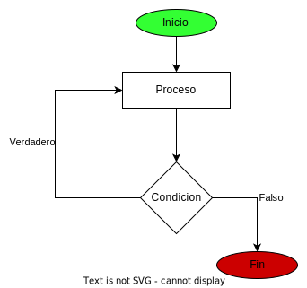

# ciclo do while

este ciclo nos permite evaluar la condicion al final del bloque con esto se consigue que el codigo se ejecute una vez mientras que con el ciclo while si la condicion es falsa no se ejecuta. 



```javascript
let salida=false
let numero
do{
    numero=prompt("escribe un numero de 1 a 10")
    numero=Number(numero)
    if(isNaN(numero)){
        if(numero>=1 && numero<=10){
            salida=true
        }
    }
}while(!salida)

```