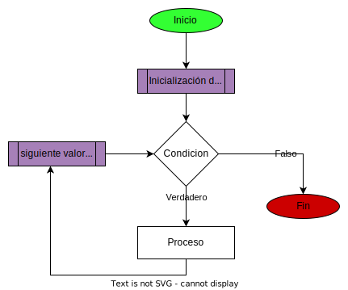

# bucle for

este bucle se usa cuando tenemos claro cuantas veces se va a ejecutar, ya que este bucle nos permite recorrer varias estructuras de datos. 



## For clasico

```javascript
for(let contador=0; contador<10; contador++){
    console.log("valor del contador "+contador)
}
```

## For of

el **for of** nos permite recorrer estructuras de datos de una forma optima lo que hace es guardar el valor de cada elemento en la variable.

Ejemplo:


```javascript
let nombre="ruben"

//imprime letra a letra el nombre
for(let letra of nombre){
    console.log(letra)
}
```


## For in

1. el **for in** nos permite recorrer estructuras de datos de una forma optima lo que hace es guardar el valor de cada indice en la variable.

2. fue creado mas para el tema de objetos para tener clave:valor.


Ejemplo:


```javascript
let nombre="ruben"

//imprime la posicion de cada letra
for(let posicion in nombre){
    console.log(posicion)
}
```

## foreach

este array nos permite recorrer un array de elementos y permite pasar varios parametros como el valor del elemento y el indice

```javascript
let nombre=["ruben","Dario","Dorian"];

nombre.forEach((dato,index)=>{
    console.log(`mi dato es ${dato} y la posicion es ${index}`);
})
```