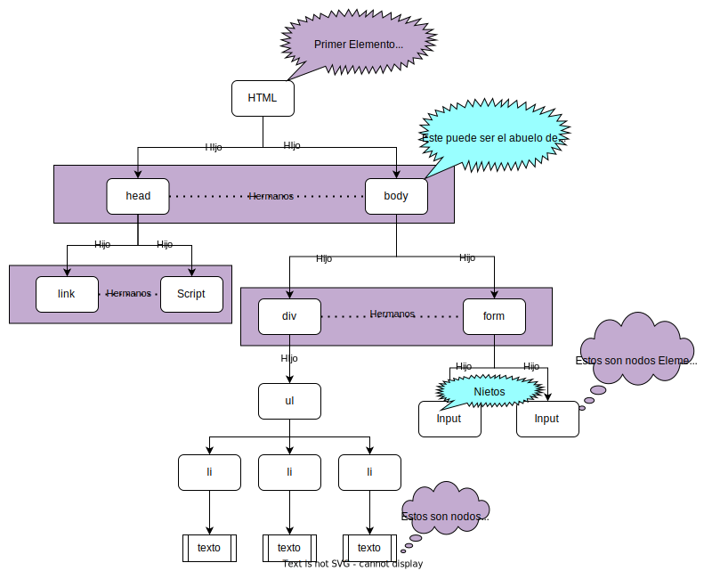

# Introduccion al DOM

1. Es toda la estructura del documento
2. No es javascript, es una API(aplication Programing Interface)
3. Se puede representar de forma de un arbol, y cada parte del arbol se representar un **nodo** los cuales los mas usados son:
   + Elementos node -1:cualquier etiqueta HTML
   + text node-3: El contenido de la etiqueta
    + Comment node -8: Cualquier comentario en HTML

4. en la mayoria de los navegadores cuando tenemos un elemento seleccionado con el mouse podemos hacer referencia a este desde consola del navegador con **$0**.
5. con **.nodeType** podemos saber que tipo de nodo tenemos seleccionado.

Ejemplo:

